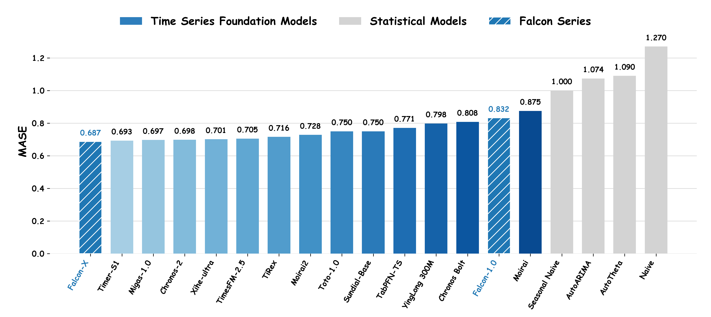

<div align="center">

# Falcon-TST: A Family of Large-Scale Time Series Foundation Model

[](https://opensource.org/licenses/Apache-2.0)
[](https://www.python.org/downloads/)
[](https://pytorch.org/)

**A family of large-scale time series foundation models for efficient and accurate time series forecasting.**

</div>

## 🚀 Latest News

- **[Jun 2026]:** 🌐 Falcon-X API is now available! See [here](falconx/README.md) for details.

- **[May 2026]:** 🚀 Released our multivariate foundation model version Falcon-X [](http://arxiv.org/abs/2605.27286). 

- **[Oct 2025]:** 🚩 Falcon-1.0 is now available on [HuggingFace](https://huggingface.co/ant-intl/Falcon-TST_Large)

Comparison of MASE on the GIFT-Eval benchmark:

<div align="center">

</div>


## 🚀 Quick Start

### Falcon-X

Falcon-X is a multivariate time series foundation model designed for heterogeneous variate modeling through a shared latent prototype space and dual-dependency modeling.

#### Installation

```bash
pip install falcon-tst
```

#### Code Example

```python
import numpy as np
from falcontst import FalconClient

# Prepare inputs
B, L, H = 32, 512, 96
context = np.random.randn(B, L)
input_mask = np.ones_like(context)

client = FalconClient()
result = client.quantile_predict(
    context=context,
    prediction_length=H,
    model_name="Falcon-X",
    input_mask=input_mask,  # 1 = observed, 0 = missing
    is_multivariate=True,
)

print(result)
```

For detailed API usage, parameters, and output format, see [falconx/README.md](falconx/README.md).

### Falcon-1.0

Falcon-1.0 is a hierarchical mixture-of-experts time series foundation model that integrates patch-wise expert specialization with sample-wise hierarchical routing.

#### Installation

Install the following dependencies

- Python >= 3.8
- PyTorch >= 2.0.0
- **transformers == 4.40.1**

#### Code Example

```python
import torch
from transformers import AutoModel

# Load pre-trained model (when available)
model = AutoModel.from_pretrained(
    'ant-intl/Falcon-TST_Large',
    trust_remote_code=True
)

# Prepare your time series data
batch_size, lookback_length, channels = 1, 2880, 7
time_series = torch.randn(batch_size, lookback_length, channels)

# Load the model and data to the same device
device = torch.cuda.current_device() if torch.cuda.is_available() else 'cpu'
model = model.to(device)
time_series = time_series.to(device)

# Generate forecasts
forecast_length = 96
predictions = model.predict(time_series, forecast_horizon=forecast_length)

print(predictions)
```


## 🙏 Acknowledgments

We sincerely thank all researchers and organizations who have contributed to the time series forecasting community. This work builds upon numerous open-source datasets and methodologies from the research community.

Special thanks to:
- Megatron-LM (https://github.com/NVIDIA/Megatron-LM)
- Chronos (https://github.com/amazon-science/chronos-forecasting)
- GIFT-Eval (https://github.com/SalesforceAIResearch/gift-eval)

## 📚 Citation
If you find this repo useful, please consider citing our paper as follows:
```bibtex
@article{liu2026falconx,
      title={Falcon-X: A Time Series Foundation Model for Heterogeneous Multivariate Modeling}, 
      author={Yiding Liu and Yifan Hu and Hongjie Xia and Peiyuan Liu and Hongzhou Chen and Xilin Dai and Zewei Dong and Jiang-Ming Yang},
      journal={arXiv preprint arXiv:2605.27286},
      year={2026}
}
```


## 📄 License

This project is licensed under the Apache License 2.0 - see the [LICENSE](LICENSE) file for details.
