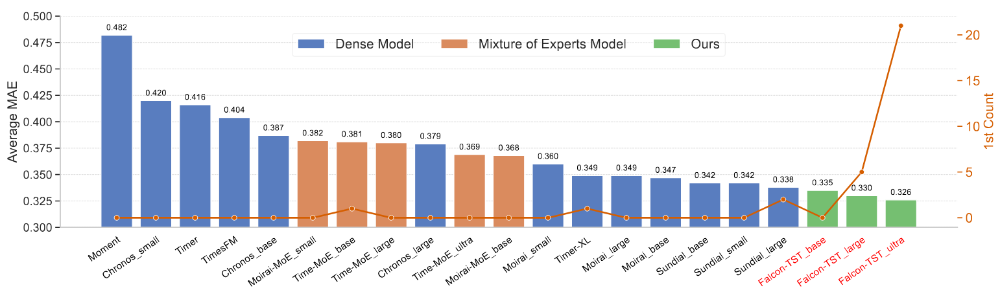

<div align="center">

# Falcon-TST: A Large-Scale Time Series Foundation Model

[](https://opensource.org/licenses/Apache-2.0)
[](https://www.python.org/downloads/)
[](https://pytorch.org/)
[](https://huggingface.co/transformers/)

**A large-scale time series foundation model utilizing Mixture of Experts (MoE) architecture with multiple patch tokenizers for efficient and accurate time series forecasting.**

</div>

## 🚀 Latest News

- 🚩 **News (2025.10)**: Falcon-TST (large) is now available on [HuggingFace](https://huggingface.co/ant-intl/PatchMoE_Large)
- 📊 **Performance**: Achieved state-of-the-art results on multiple time series benchmarks
- 🔧 **Integration**: Full compatibility with HuggingFace Transformers ecosystem

## 📖 Introduction

Falcon-TST is a cutting-edge time series foundation model that leverages the power of Mixture of Experts (MoE) architecture combined with multiple patch tokenizers. This innovative approach enables efficient processing of time series data while maintaining high accuracy across various forecasting tasks.

### Key Features

- **Multi-Scale Patch Processing**: Utilizes multiple patch sizes for comprehensive temporal pattern capture
- **Mixture of Experts**: Efficient routing mechanism for scalable model capacity
- **Flexible Input / Output Length**: Supports arbitrary input and output length

<!-- <div align="center">
    
    <p><em>PatchMoE Architecture Overview</em></p>
</div> -->


### Model Configurations

| Model | <i>L<sub>MoE</sub></i> | <i>L<sub>Expert</sub></i> | Heads | <i>d<sub>model</sub></i> | <i>d<sub>ff</sub></i> | <i>L</i> | Experts | <i>k</i> | Average Activated Params | Total Params |
|:-----:|:---------:|:------------:|:-----:|:------------:|:-----------:|:----:|:-------:|:---:|:---------:|:--------:|
| Falcon-TST<sub>base<sub> | 2 | 4 | 8 | 512 | 2048 | 1440 | 4 | 1 | 200M | 440M |
| Falcon-TST<sub>large<sub> | 2 | 4 | 16 | 1024 | 4096 | 2880 | 4 | 1 | 1.2B | 2.5B |
| Falcon-TST<sub>ultra<sub> | 3 | 4 | 16 | 1024 | 4096 | 2880 | 8 | 2 | 3.8B | 8.5B |

### Performance
<!-- #### todo: figures and text
Falcon-TST achieves state-of-the-art performance on multiple time series forecasting benchmarks:

- **Time-Series-Library**: Ranked #1 in MSE/MAE metrics
- **ETT Dataset**: Superior performance across all variants (ETTh1, ETTh2, ETTm1, ETTm2)
- **Weather Dataset**: Consistent improvements over baseline models
- **Electricity Dataset**: Excellent scalability for high-dimensional time series -->


<!--  -->
<!--  -->

### Inference Time on different devices

<!-- | Lookback | Forcast | Inference Time |Device |
| ------------------- | -------------- | -------------- | -------------- |
| 2880              | 96 | 194.685ms        | Apple M4 Pro
| 2880              | 192 | 195.189ms        | Apple M4 Pro
| 2880              | 336 | 195.945ms        | Apple M4 Pro
| 2880              | 720 | 891.788ms        | Apple M4 Pro
| 2880              | 96 | 22.302ms         | A10
| 2880              | 192 | 22.689ms         | A10
| 2880              | 336 | 23.559ms         | A10
| 2880              | 720 | 84.543ms         | A10
| 2880              | 96 | 19.399ms         | A100
| 2880              | 192 | 19.745ms         | A100
| 2880              | 336 | 19.924ms         | A100
| 2880              | 720 | 76.741ms         | A100 -->

<!--  -->
<div align="center">

</div>


## 🚀 Quick Start

### Installation

1. Clone the repository

```bash
git clone https://github.com/patch-moe/patchmoe.git
cd patchmoe
```

2. Install the following dependencies

- Python >= 3.8
- PyTorch >= 2.0.0
- transformers == 4.40.1

### Code Example

```python
import torch
from transformers import AutoModelForCausalLM, AutoConfig

# Load pre-trained model (when available)
model = AutoModelForCausalLM.from_pretrained(
    'ant-intl/PatchMoE_Large', 
    trust_remote_code=True
)

# Prepare your time series data
batch_size, lookback_length, channels = 1, 2880, 7
time_series = torch.randn(batch_size, lookback_length, channels)

# Generate forecasts
forecast_length = 96
predictions = model.generate(time_series, max_new_tokens=forecast_length)
```

### Evaluation

+ Prepare the benchmark datasets

You can access the well-acknowledged long-term forecast datasets from [[Google Drive]](https://drive.google.com/drive/folders/1ZOYpTUa82_jCcxIdTmyr0LXQfvaM9vIy), and place the datasets under `./dataset`.

+ Benchmark evaluation on ETTh1

```bash
python run_eval.py --ckpt_path ant-intl/PatchMoE_Large --root_path ./dataset --test_data_list ETTh1
```

### Advanced Usage

More advanced usages like pre-training and fine-tuning examples are coming soon.

## 🙏 Acknowledgments

We sincerely thank all researchers and organizations who have contributed to the time series forecasting community. This work builds upon numerous open-source datasets and methodologies from the research community.

Special thanks to:
- Megatron-LM (https://github.com/NVIDIA/Megatron-LM)
- Time-MoE (https://github.com/Time-MoE/Time-MoE)
- Time-300B (https://huggingface.co/datasets/Maple728/Time-300B)
- Time-Series-Library (https://github.com/thuml/Time-Series-Library)

## 📄 License

This project is licensed under the Apache License 2.0 - see the [LICENSE](LICENSE) file for details.
